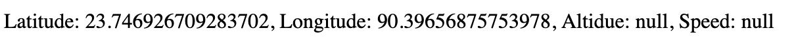

The window.navigator.geolocation object in JavaScript provides access to the browser's geolocation services, allowing you to obtain the user's current location.

```js
if (navigator.geolocation) {
  navigator.geolocation.getCurrentPosition(successCallback, errorCallback);
} else {
  document.write("Geolocation is not supported by this browser");
}

function successCallback(position) {
  const latitude = position.coords.latitude;
  const longitude = position.coords.longitude;
  const altitude = position.coords.altitude;
  const speed = position.coords.speed;

  document.write(
    `Latitude: ${latitude}, Longitude: ${longitude}, Altitude: ${altitude}, Speed: ${speed}`
  );
}

function errorCallback(error) {
  document.write(`Geolocation error: ${error.message}`);
}
```



Explanation:

    Feature Detection: The code checks if the browser supports the Geolocation API using navigator.geolocation.

    getCurrentPosition Method: If supported, it calls the getCurrentPosition method, which takes two callback functions as parameters:
        successCallback: Invoked when the location is successfully retrieved.
        errorCallback: Invoked if there's an error while retrieving the location.

    Success Callback: If the location is successfully obtained, the successCallback function is called with a Position object containing the latitude and longitude.

    Error Callback: If there's an error, the errorCallback function is called with a PositionError object.

Note: Accessing geolocation information usually requires the user's permission, and some browsers may block this feature on non-secure (non-HTTPS) websites for security reasons. Ensure that your website is served over HTTPS if you intend to use the Geolocation API in production.
